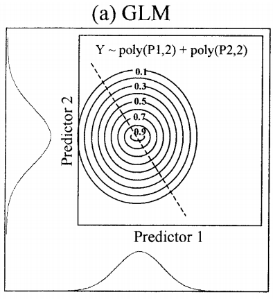
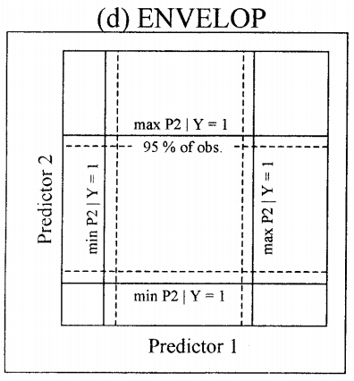

***

##Chapter 1 Introduction

Synonyms: Climate modelling envelope, habitat modelling, and niche-modeling.

Main Aim: to estimate the similarity of the condition at any site to the conditions at any sites to the conditions at the locations of known occurence of a phenomenon.

##### Major steps in SDMs:

1. a compilation of species occurence locations
2. values of environmental predictor variables (such as climate), extracted from climate databases
3. model fitting
4. prediction of variable of interest across an the region of interest

Required packages:
__install.packages(c(’raster’, ’rgdal’, ’dismo’, ’rJava’))__

***
##Chapter 2 Species occurence data


All model perform better with  unbiased and error-free data. Garbage in garbage out applies.

> Improving the quality of occurrence data first, model comparison second.


```{r include=T, echo=T, eval=FALSE}
#load libraries
library(raster)
library(rgdal)
library(dismo)
library(rJava)
library(readr)
```

### 2.1 Presence data input arrangements
```{r collapse=T}
#load occurence dataset: Bradypus data example
 bradypus <- read_csv(paste(system.file(package="dismo"), "/ex/bradypus.csv", sep=""))
head(bradypus)

```

Species occurence dataframe consists of:

1. species name
2. x or longitude
3. y or latitude

Do not change the order. A single row represents an occurence. Many occurence has 
Data can be gathered from Global Biodiversity Inventory Facility (GBIF) (http:
//www.gbif.org/).
~~We can use a function from dismo package to download species occurence data from GBIF :~~


Dismo uses the old GBIF API therefore use occ function from spocc package (Interface to many species occurrence data sources):

### 2.2 Load data from GBIF
```{r load data from GBIF}
library(spocc)
acaule<- occ(query="Solanum acaule", from='gbif', limit=10000)
acaule<-acaule$gbif$data$Solanum_acaule
#data dimension
dim(acaule)

#data column names
colnames(acaule)
library(plyr)
acaule$country<-revalue(acaule$country, c("Bolivia, Plurinational State of"="Bolivia"))

```


### 2.3 Data cleaning
#### 2.3.1 Unfiltered data visualisation
Create a map of species occurence

```{r unfiltered presence data}
#data filtering, select the records that have longitude and latitude data
acgeo <- (subset(acaule, !is.na(longitude) & !is.na(latitude)))
dim(acgeo)

library(maptools)
data("wrld_simpl") # lightweight global map, not reccomended for 
plot(wrld_simpl, xlim=c(-40,20), ylim=c(-70,70), axes=T, col='light yellow')
box()
points(acgeo$longitude, acgeo$latitude, col='orange', pch=20, cex=0.75)
 points(acgeo$longitude, acgeo$latitude, col='red', cex=0.75)
 


```

*Solanum acaule* presents in the higher parts of the Andes mountains of southern Peru, Bolivia, and Northern Argentina. 

As we see from the map, there are some errors occured. Points in Sweden, Mexico, Southern argentina, and Brazil might not be true. Background knowledge on species distribution is required.

Common mistakes:

1. missing minus signs
2. duplicates (identical data points that were submitted twice or more)
3. latitude/longitude typo
4. 0 coordinates where 'NAs' were intended (not georeferenced yet, we can apply "geo=FALSE option to get non-georeferenced recodrs, some of it may have a textual georeference or locality description")
5. Some data records in GBIF coes with uncertaint asscociated with the georeferences.

#### 2.3.2 Filtered data visualisation based on expert judgement/background knowledge
```{r filtered presence data}

dim(acgeo) #unfiltered dataset
#remove error data pouints from acgeo
filtered_acgeo<-dplyr::filter(acgeo, (longitude<(-55)&latitude<0& latitude>=-35)) #removing data points on South Argentina, Peru, Sweden, and Brazil

dim(filtered_acgeo) #filtered dataset

#filtered dataset
plot(wrld_simpl, xlim=c(-40,20), ylim=c(-70,70), axes=T, col='light yellow')
box()
points(filtered_acgeo$longitude, filtered_acgeo$latitude, col='orange', pch=20, cex=0.75)
 points(filtered_acgeo$longitude, filtered_acgeo$latitude, col='red', cex=0.75)

```
#### 2.3.4 Cross-checking

cross-check corrdinates by visual and other means. In this case, we compare the country as specified by the records with the country implied by the coordinates.

```{r}
acg<-filtered_acgeo
library(sp)
coordinates(acg)<- ~longitude+latitude

gadm_countries<-readRDS("./data/countries_gadm28.rds") # GADM map is high in accuracy but heavier to load than the wrld_simpl map embedded in R 

crs(acg)<-crs(gadm_countries)

# a check whether both datasets are under same data type and crs
class (acg)
class(gadm_countries)

ovr <- over(acg, gadm_countries)
cntr <- ovr$NAME
i <- which(is.na(cntr)) # which data points do not match any country

j <- which(cntr!= acg$country) # which data points missmatch
cbind(as.character(cntr), acg$country)[j,]

plot(acg)
plot(gadm_countries, add=T, border='blue', lwd=2)
points(acg[j, ], col='red', pch=20, cex=2)


```

All data points matched with the assigned countries, no missmatch found.

#### 2.3.5 Sampling bias

Subsampling records is an attempt to remove some of the bias by only selecting one data point per grid.
However, this reduces the locally dense records which might be a true reflection of the relative suitable habitat. If that is the case, this sampling bias procedure can potentially lead to 'underestimation'.

>A fundamental limitation of presence-only data is that  sample  selection  bias  (whereby  some  areas  in  the landscape are sampled more intensively than others) has a much  stronger  effect  on  presence-only  models  than  on presence-absence models, see 10.1111/j.1472-4642.2010.00725.x


```{r Sampling Bias}

r<-raster(acg) # generate a raster layer with the extent of acg
res(r)<-1 # 1 degree spatial resolution
r<-extend(r, extent(r)+1) # expand the r extent by 1 degree

acsel<-gridSample(acg, r, n=1)  # this allows only one sample per cell
#Chess-board function can be used as the sampling strategy to split data and training and testing sets.


p <- rasterToPolygons(r)
plot(p, border='gray')
points(acg)
points(acsel, cex=1, col='red', pch='x')

#file <- paste(system.file(package="dismo"), '/ex/acaule.csv', sep='')
write.csv(acsel, "./data/acaule.csv")
acsel <- read.csv("./data/acaule.csv") #Cleaned data

```


##Chapter 3 Absence and background points

If we have a large dataset with presence/absence and well designed survey, we should apply a method that can use these data (GLM framework a.k.a the classical approach).

Presence only data still can be used in a method that needs absence data. We substitute absence data with background data.  However, background data is not equal with pseudo-absence data.

It's safer to define backround data is used to characterise (the probability density of) environments in the study region, rather than attempting to guess at absence locations.

Please mind that absence data can be biased and incomplete.

> Absence data are plagued by issues of detection probability (Wintle et al. , 2004; MacKenzie, 2005) so that even presence-absence data may not yield a good estimate of prevalence, see 10.1111/j.1472-4642.2010.00725.x

### 3.1 Generating background points

```{r}
#get the predetermined file names
files <- list.files(path=paste(system.file(package="dismo"), '/ex',sep=''), pattern='grd', full.names=TRUE )

mask <- raster(files[1]) #apply the first file to create a RasterLayer
set.seed(1963) # set seed to assure that the examples will always have the same random sample
bg<- randomPoints(mask,500) # select 500 random points; the points will lie on grids that have values, no points will be generated on NAs

#inspect the results by plotting:

par(mfrow=c(1,2))
plot(!is.na(mask), legend=FALSE) # plotting with boolean values
points(bg, cex=0.5)

# we repeat the samplin, but limit the area of sampling using a spatial extent
e<-extent(-80, -53, -39, -22)
bg2<-randomPoints(mask, 50, ext=e)
plot(!is.na(mask), legend=FALSE)
plot(e, add=TRUE, col='red')
points(bg2, cex=0.5)

```

### 3.2 Generating pseudo-absence points


VanDerWal et al. (2009) sampled withn a radius of presence points to sample ; basically this is a more restricted area of background points.

```{r}
ac<-read_csv("./data/acaule.csv")
#convert the data.frame into a SpatialPointsDataFrame
coordinates(ac)<-~longitude-latitude
projection(ac)<- CRS('+proj=longlat +datum=WGS84')

# circles with a radius of 50 km
x <- circles(ac, d=50000, lonlat=TRUE)
pol <- polygons(x)


# sample randomly from all circles
samp1 <- spsample(pol, 250, type='random', iter=25)
# get unique cells
cells <- cellFromXY(mask, samp1) #Get cell (pixel) number
length(cells)
cells <- unique(cells) # get rid of duplicates, or points under the same pixels
length(cells)

xy <- xyFromCell(mask, cells) # return the vector of cells back to SpatialPointsDataFrame
plot(pol, axes=TRUE)
points(xy, cex=0.75, pch=20, col='blue') # pseudo absence points
#points(ac, cex=0.5, pch=20, col='red') # presence points


```

Not all the pseudo absence points within the polygons. We will remove the points outside the polygons with the functions below:

```{r}
spxy <- SpatialPoints(xy, proj4string=CRS('+proj=longlat +datum=WGS84'))
o <- over(spxy, geometry(x)) # overlay function
xyInside <- xy[!is.na(o), ] #remove NAs
plot(pol, axes=T)
points(xy,  col='blue', cex=0.75, pch=20)
points(xyInside,  col='red', cex=0.75, pch=20)
#blue points represent the data points that lie outside the polygons, overlay function selects data points that lie inside the polygons (red).
```


##Chapter 4 Environmental data

### 4.1 Raster data covariates

There are many terms for the predictor variables in SDMs: independent variables, environmental covariates, predictors, etc.

Avoid to use ASCII because it is slow. See http://www.worldclim.org/bioclim for descriptions for bioclimatic varaibles codes.

```{r}
#load predictor raster data
files <- list.files(path=paste(system.file(package="dismo"),'/ex', sep=''), pattern='grd', full.names=TRUE )

predictors <- stack(files)
names(predictors)
plot(predictors)
```

Overlay the administration boundaries and presence points:
```{r}
library(maptools)
data(wrld_simpl)
file <- paste(system.file(package="dismo"), "/ex/bradypus.csv", sep="")
bradypus <- read_csv(file)
# we do not need the first column
bradypus <- bradypus[,-1]


# first layer of the RasterStack
plot(predictors, 1)
# note the "add=TRUE" argument with plot
plot(wrld_simpl, add=TRUE)
# with the points function, "add" is implicit
points(bradypus, col='blue')

```

Predictor variable selection is crucial when the objective f the study is prediction. In prediction we will apply new times or places, e.g., beyond the same geographic areas.

### 4.2 Extracting values from rasters

We apply extract function to extract for the _Bradypus_ occurence points and for the 500 random background points.

```{r}
presvals <- extract(predictors, bradypus)
# setting random seed to always create the same
# random set of points for this example
set.seed(0)
backgr <- randomPoints(predictors, 500)
absvals <- extract(predictors, backgr)
pb <- c(rep(1, nrow(presvals)), rep(0, nrow(absvals)))
sdmdata <- data.frame(cbind(pb, rbind(presvals, absvals)))
sdmdata[,'biome'] = as.factor(sdmdata[,'biome']) #define biomes as factor
head(sdmdata)

summary(sdmdata)

```
Bioclimatic variables:

BIO1 = Annual Mean Temperature
BIO5 = Max Temperature of Warmest Month
BIO6 = Min Temperature of Coldest Month
BIO7 = Temperature Annual Range (BIO5-BIO6)
BIO8 = Mean Temperature of Wettest Quarter
BIO12 = Annual Precipitation
BIO16 = Precipitation of Wettest Quarter
BIO17 = Precipitation of Driest Quarter

Model selection process involves a check for collinearity.

```{r echo=T}
# pairs plot of the values of the climate data
# at the bradypus occurrence sites.
#pairs(sdmdata[,2:5], cex=0.1, fig=TRUE)
#See Dormann et al. (2013)for a discussion of methods to remove colinearity.

##Correlation matrix; a better version than 'pairs' function
library(psych)
pairs.panels(sdmdata[,2:9], 
             method = "pearson", # correlation method
             hist.col = "#00AFBB",
             density = TRUE,  # show density plots
             ellipses = TRUE # show correlation ellipses
             )

#find variables with high correlation
library(caret)
correlated_variables<-findCorrelation(cor(sdmdata[,2:9]), cutoff = .7, exact = T, names=F)
```


"findCorrelation" suggest __`r colnames(sdmdata[correlated_variables+1])`__ is/are potentially collinear with other predictors.


***

##Chapter 5 Model fitting

### 5.1 Classic GLM model



```{r}


m1 <- glm(pb ~ bio1 + bio5 + bio12, data=sdmdata)
class(m1)
summary(m1)

```

### 5.1 Classic Bioclim model



```{r}
bc <- bioclim(presvals[,c('bio1', 'bio5', 'bio12')])
bc
```

```{r}
#Generate response plots for each bioclimatc variable
response(bc)
```


##Chapter 6 Model prediction

Most of the purpose of SDM is to create a map of suitability scores. R can handle this easily by providing a raster object and a model object.

```{r}
p <- predict(predictors, m1)
plot(p)
```


##Chapter 7 Model evaluation

Pretty much model evaluation is focused on how well the data predicts to points not used in model training (cross-validation of partitioned data, e.g., chessboard sampling). In other words,  this consists of creating a model with one ’training’ data set, and testing it with another data set of known occurrences.

Some checkpoints in model evaluation includes:

1. ecologically sensible.
2. fitted functions make sense
3. reasonable predictions (pass visual and quantitative check)
4. no spatial patterns in model residuals

Meaasures for evaluation models are often 'threshold dependent'. Values above the threshold values indicate presence and values below the threshold values indicate absence.

the Area Under the Receiver Operator Curve (AUC) is the most widely used non threshold evaluation method. AUC is a measure of rank correlation. 
AUC score of 0.5 means that the model is as hood as a random guess.


Here is an illustration on how AUC is computed:

We start off by generating two varaibles with random normally distributed values, but different mean and standard deviation.
```{r AUC}
p <- rnorm(50, mean=0.7, sd=0.3)
a <- rnorm(50, mean=0.4, sd=0.4)
par(mfrow=c(1, 2))
plot(sort(p), col='red', pch=21)
points(sort(a), col='blue', pch=24)
legend(1, 0.95 * max(a,p), c('presence', 'absence'), pch=c(21,24), col=c('red', 'blue'))
comb = c(p,a)
group = c(rep('presence', length(p)), rep('absence', length(a)))
boxplot(comb~group, col=c('blue', 'red'))
```


Then, we compute the  correlation coeeficient:

```{r}
group = c(rep(1, length(p)), rep(0, length(a)))
cor.test(comb, group)$estimate
mv <- wilcox.test(p,a)
auc <- as.numeric(mv$statistic) / (length(p) * length(a))
auc
```

Alternatively, we can use model evaluation functions from 'dismo' package:
```{r}
e<-evaluate(p=p, a=a)
e
```

```{r}
par(mfrow=c(1, 2))
density(e)
boxplot(e, col=c('blue', 'red'))
```


```{r}
samp <- sample(nrow(sdmdata), round(0.75 * nrow(sdmdata)))
traindata <- sdmdata[samp,]
traindata <- traindata[traindata[,1] == 1, 2:9]
testdata <- sdmdata[-samp,]
bc <- bioclim(traindata)
e <- evaluate(testdata[testdata==1,], testdata[testdata==0,], bc)
e
```

```{r}
plot(e, 'ROC')

```


In the presence-only data, we divide the data in two random sets, one for training the model and one for evaluating the model.

```{r}
samp <- sample(nrow(sdmdata), round(0.75 * nrow(sdmdata))) # select 75% of the total data, gives you back in row numbers
traindata <- sdmdata[samp,] #get the data based on the selected row numbers

traindata <- traindata[traindata[,1] == 1, 2:9] 
testdata <- sdmdata[-samp,] # select test data


bc <- bioclim(traindata)
e <- evaluate(testdata[testdata==1,], testdata[testdata==0,], bc)
e
```
```{r}
plot(e, 'ROC')

```


For a more rigorous partitioning procedure, we can use  k-fild data partitioning. It creates a vector that assigns each row in the data matrix to a group ( between 1 to k). In this case we use k=5 which means we can fit and tests our model five times.


```{r}
pres <- sdmdata[sdmdata[,1] == 1, 2:9]
back <- sdmdata[sdmdata[,1] == 0, 2:9]

k <- 5
group <- kfold(pres, k)
group[1:10]

```


```{r}
e <- list()
for (i in 1:k) {
  train <- pres[group != i,] # if k =1, then train data consists of k=2,3,4,5
  test <- pres[group == i,] # if k =1, then test data consists of k=1
  bc <- bioclim(train)
  e[[i]] <- evaluate(p=test, a=back, bc) ;#background remains the same
}

```

```{r}
auc <- sapply( e, function(x){slot(x, 'auc')} )
auc
mean(auc) #mean AUC values

```

```{r}
#the ”maximum of the sum of the sensitivity (true positive rate) and specificity (true negative rate)”

 sapply( e, function(x){ x@t[which.max(x@TPR + x@TNR)] } )
```

AUC indicator is highly spatial extent- sensitive. The larger the extent, the higher AUC value. In this sense, AUC values are biased and cannot be directly compared.

To resolve this problem, we can apply "point-wise distance sampling" to remove "spatial sorting bias".
```{r}
nr <- nrow(bradypus)
s <- sample(nr, 0.25 * nr) #sample a quarter of presence data
pres_train <- bradypus[-s, ] # select 75% (non-s)
pres_test <- bradypus[s, ] # select the sampled data (s)
nr <- nrow(backgr)
s <- sample(nr, 0.25 * nr)
back_train <- backgr[-s, ]
back_test <- backgr[s, ]

#spatial sorting bias
sb<-ssb(pres_test, back_test, pres_train)
sb[,1] / sb[,2] # an indicator of spatial sorting bias

```

If there is no SSB, the value should be 1, SSB is very strong when the result close to zero.


```{r}
#point wise distance sampling
i <- pwdSample(pres_test, back_test, pres_train, n=1, tr=0.1)
pres_test_pwd <- pres_test[!is.na(i[,1]), ]
back_test_pwd <- back_test[na.omit(as.vector(i)), ]
sb2 <- ssb(pres_test_pwd, back_test_pwd, pres_train)
sb2[1]/ sb2[2] # SSB has been removed!
```


Run the model again and evaluate the model.
```{r}
bc <- bioclim(predictors, pres_train)
e<-evaluate(bc, p=pres_test, a=back_test, x=predictors)
plot(e, 'ROC')
```

